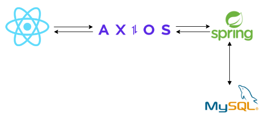
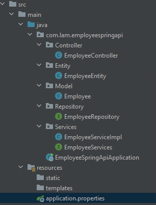
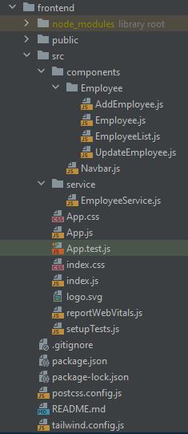
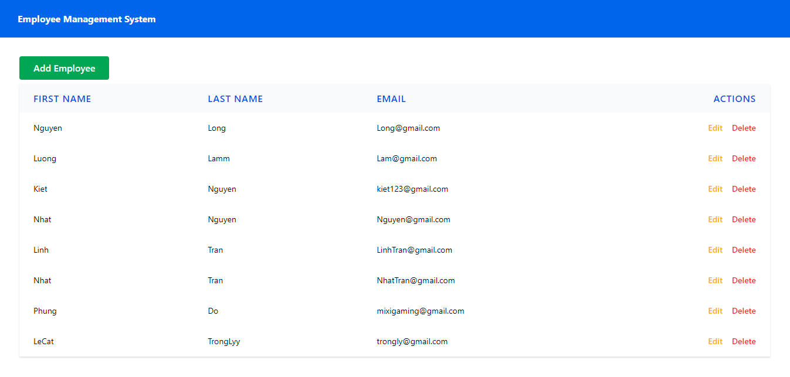
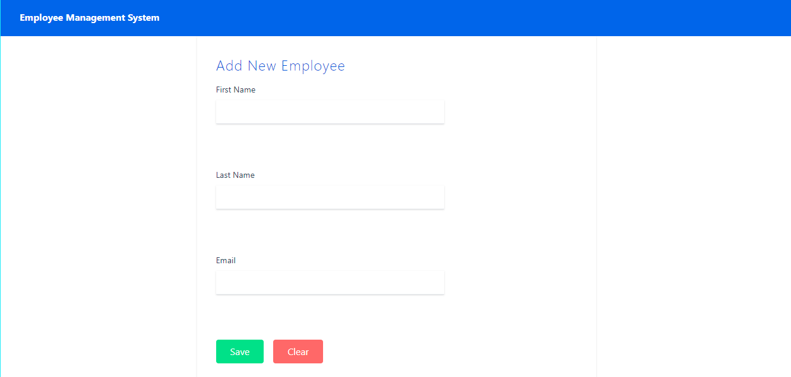
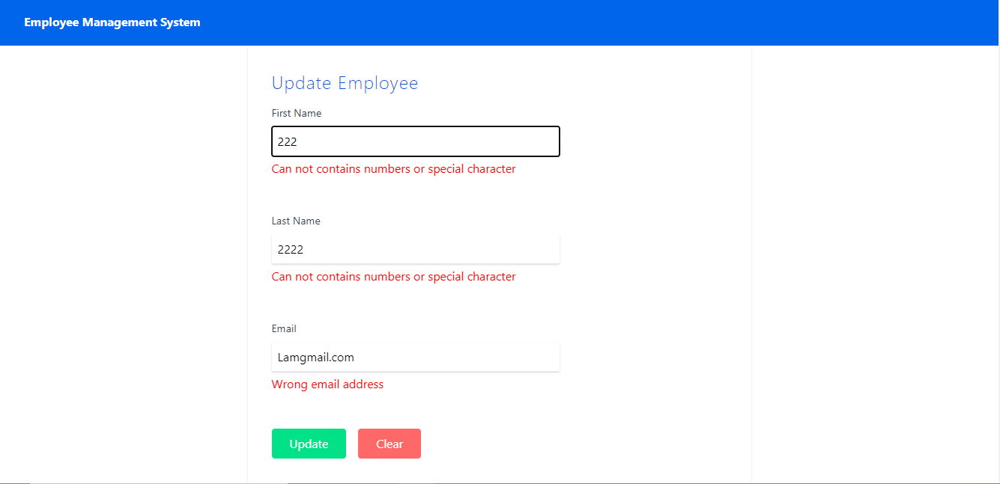

# CRUD Employee Management

## - Sử dụng ReactJs, SpringBoot, MySQL để xây dụng một ứng dụng CRUD cơ bản

## - Cấu trúc file bên phía back-end :

## - Cấu trúc file bên phía front-end :

## - Các thư viện cần cài đặt

1. react-router-dom
2. react-hook-form
3. tailwindcss
4. axios
5. react-hot-toast

## - Các chức năng cơ bản

### Đọc danh sách nhân viên từ MySql và hiển thị ra :

### Thêm nhân viên vào MySql từ form :

### Xoá nhân viên và Cập nhật nhân viên vào MySql từ form :

